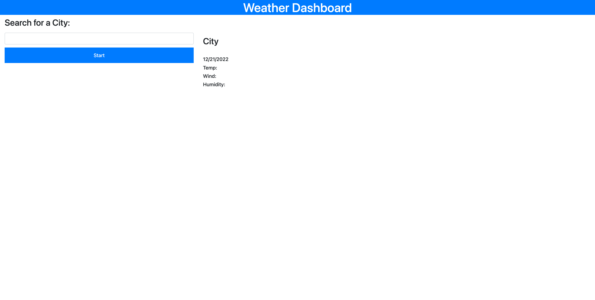
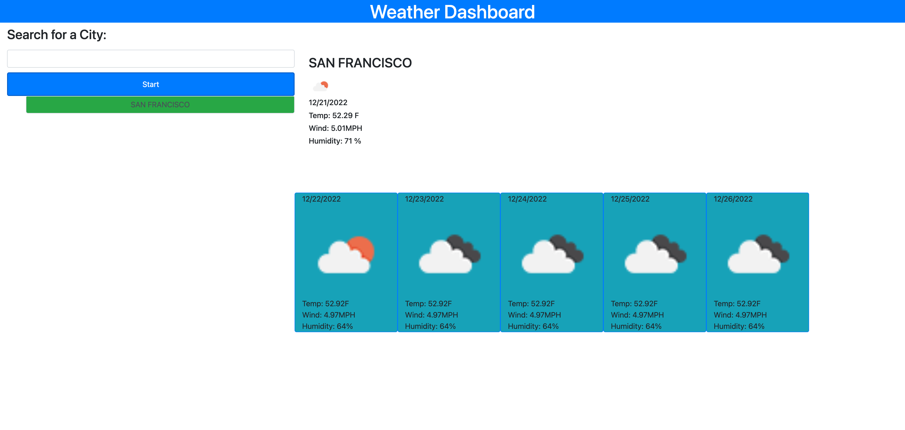

# Weather-Dashboard
****************************************************************
## Description
Weather dashboard uses the openweathermap api to get weather data.   
The dashboard shows the current weather and the forecast for the next five days.  
Also it creates buttons for the history of last searches.

## Built With
* HTML
* CSS
* JavaScript
* JQuery
* Bootstrap CSS
* 3rd Party APIs Used
    - https://api.openweathermap.org

## Directions
Go to https://rypab4.github.io/Weather-Dashboard/

1.  Enter the city you would like to find the forecast.

2.  The Weather for today will show on the top and below is the forecast for the next five days.  Also a button for cities searched before will appear on the bottom of the start button.  The city name, date, and an icon representing the weather conditions, temperature, the wind speed and the humidity will be shown.

3.  You can click on the city button to see the weather again.

### Deployed Websites
https://rypab4.github.io/Weather-Dashboard/

## GitHub Link

https://github.com/matt530bailey/what-to-watch-today
